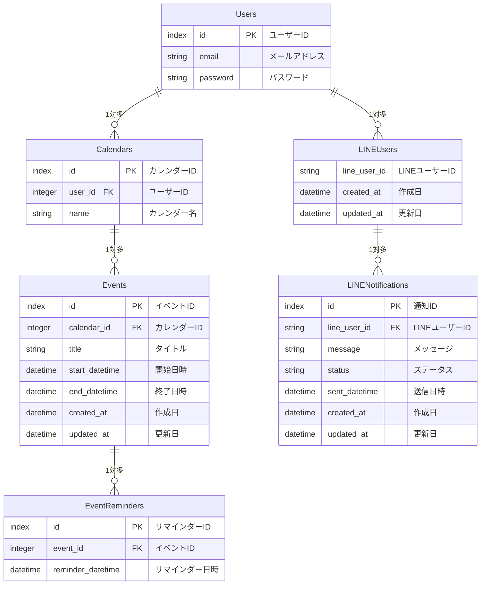

```mermaid
erDiagram
  Users ||--o{ Calendars : "1対多"
   Users ||--o{ LINEUsers : "1対多"
  Calendars ||--o{ Events : "1対多"
  Events ||--o{ EventReminders : "1対多"
  LINEUsers ||--o{ LINENotifications : "1対多"

    Users {
      index id PK "ユーザーID"
      string email "メールアドレス"
      string password "パスワード"
    }

    Calendars {
      index id PK "カレンダーID"
      integer user_id　FK "ユーザーID"
      string name "カレンダー名"
    }

    Events {
      index id PK "イベントID"
      integer calendar_id FK "カレンダーID"
      string title "タイトル"
      datetime start_datetime "開始日時"
      datetime end_datetime "終了日時"
      datetime created_at "作成日"
      datetime updated_at "更新日"
  }

    EventReminders {
      index id PK "リマインダーID"
      integer event_id FK "イベントID"
      datetime reminder_datetime "リマインダー日時"
    }

    LINEUsers{
      string line_user_id "LINEユーザーID"
      datetime created_at "作成日"
      datetime updated_at "更新日"
    }

    LINENotifications {
      index id PK "通知ID"
      string line_user_id FK "LINEユーザーID"
      string message "メッセージ"
      string status "ステータス"
      datetime sent_datetime "送信日時"
      datetime created_at "作成日"
      datetime updated_at "更新日"
    }
```