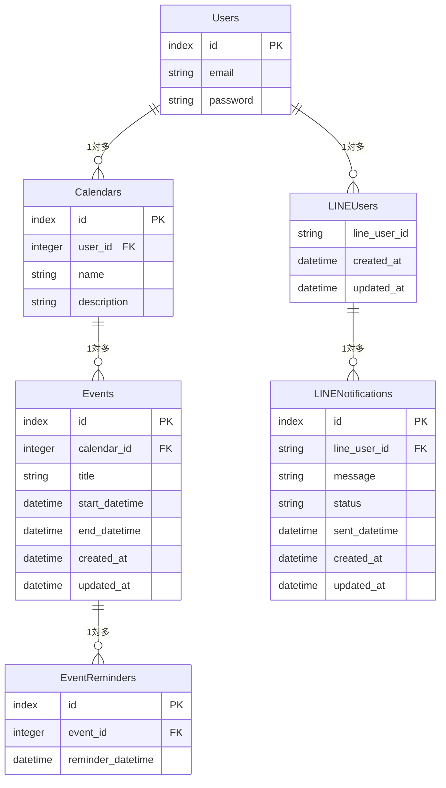

```mermaid
erDiagram
  Users ||--o{ Calendars : "1対多"
   Users ||--o{ LINEUsers : "1対多"
  Calendars ||--o{ Events : "1対多"
  Events ||--o{ EventReminders : "1対多"
  LINEUsers ||--o{ LINENotifications : "1対多"

    Users {
      index id PK
      string email
      string password
    }

    Calendars {
      index id PK
      integer user_id　FK
      string name
      string description
    }

    Events {
      index id PK
      integer calendar_id FK
      string title
      datetime start_datetime
      datetime end_datetime
      datetime created_at
      datetime updated_at
  }

    EventReminders {
      index id PK
      integer event_id FK
      datetime reminder_datetime
    }

    LINEUsers{
      string line_user_id
      datetime created_at
      datetime updated_at
    }

    LINENotifications {
      index id PK
      string line_user_id FK
      string message
      string status
      datetime sent_datetime
      datetime created_at
      datetime updated_at
    }
```