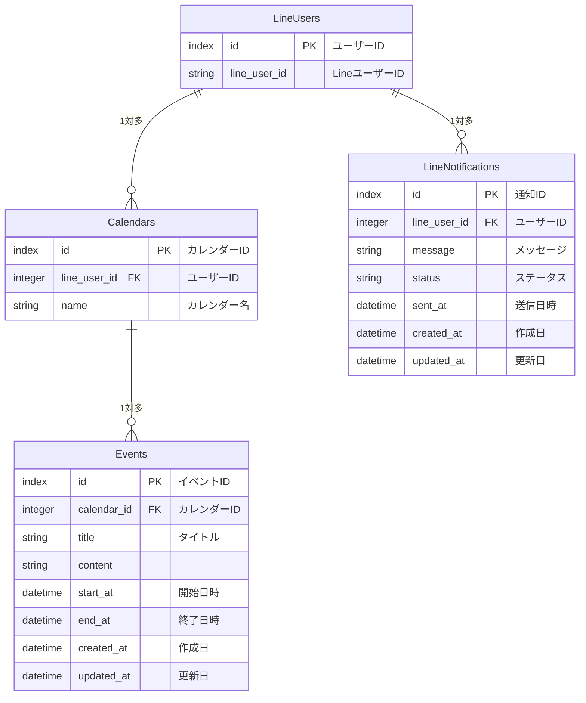

```mermaid
erDiagram
  LineUsers ||--o{ Calendars : "1対多"
  Calendars ||--o{ Events : "1対多"
  LineUsers ||--o{ LineNotifications : "1対多"

    LineUsers {
      index id PK "ユーザーID"
      string line_user_id "LineユーザーID"
    }

    Calendars {
      index id PK "カレンダーID"
      integer line_user_id　FK "ユーザーID"
      string name "カレンダー名"
    }

    Events {
      index id PK "イベントID"
      integer calendar_id FK "カレンダーID"
      string title "タイトル"
      string content 
      datetime start_at "開始日時"
      datetime end_at "終了日時"
      datetime created_at "作成日"
      datetime updated_at "更新日"
  }

    LineNotifications {
      index id PK "通知ID"
      integer line_user_id FK "ユーザーID"
      string message "メッセージ"
      string status "ステータス"
      datetime sent_at "送信日時"
      datetime created_at "作成日"
      datetime updated_at "更新日"
    }
```