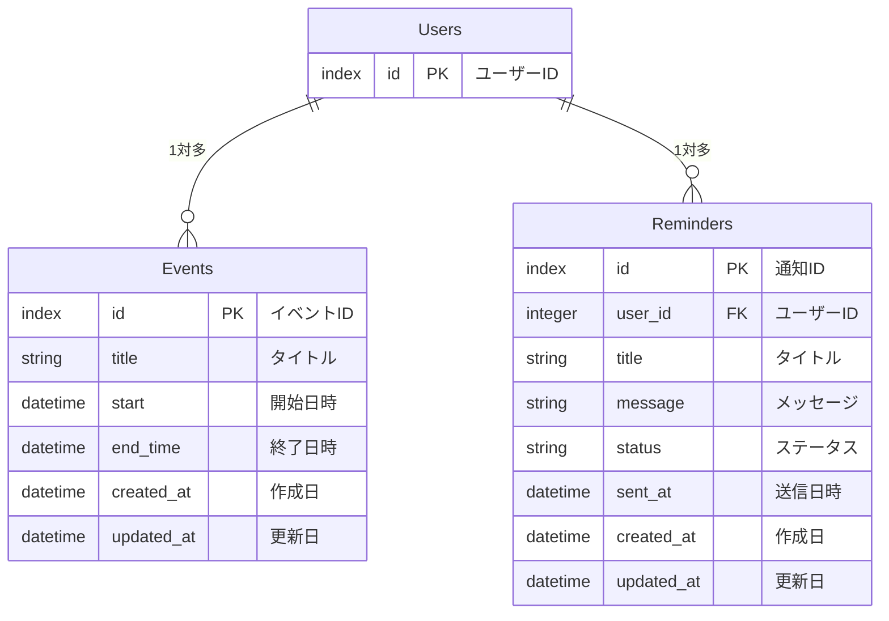

```mermaid
erDiagram
  Users ||--o{ Events : "1対多"
  Users ||--o{ Reminders : "1対多"

    Users {
      index id PK "ユーザーID"
    }

    Events {
      index id PK "イベントID"
      string title "タイトル"
      datetime start "開始日時"
      datetime end_time "終了日時"
      datetime created_at "作成日"
      datetime updated_at "更新日"
  }

    Reminders {
      index id PK "通知ID"
      integer user_id FK "ユーザーID"
      string title "タイトル"
      string message "メッセージ"
      string status "ステータス"
      datetime sent_at "送信日時"
      datetime created_at "作成日"
      datetime updated_at "更新日"
    }
```